# CI/CD Pipeline Documentation

This document provides comprehensive documentation for the CI/CD pipeline implemented for the Protein Disorder Classification API, including code quality, security, infrastructure validation, and deployment automation.

## Table of Contents

- [Overview](#overview)
- [Pipeline Architecture](#pipeline-architecture)
- [Code Quality Workflows](#code-quality-workflows)
- [Infrastructure Workflows](#infrastructure-workflows)
- [Deployment Workflows](#deployment-workflows)
- [Configuration Files](#configuration-files)
- [Quality Gates](#quality-gates)
- [Local Development](#local-development)
- [Troubleshooting](#troubleshooting)

## Overview

The CI/CD pipeline ensures code quality, security, infrastructure compliance, and reliable deployments through **9 automated workflows** that run on every commit, pull request, and deployment trigger. This pipeline embodies enterprise-grade practices with a focus on catching issues early and automating deployments safely.

### Design Philosophy

1. **Shift-Left Quality** - Catch issues in development before they reach production
2. **Triple-Gated Infrastructure** - Terraform changes must pass linting, security, and cost validation
3. **Comprehensive Security** - Multiple scanning tools with weekly scheduled scans
4. **Zero-Downtime Deployments** - Automated ECS deployments with health checks
5. **Developer Experience** - Fast feedback loops with parallel execution and caching

## Pipeline Architecture

The CI/CD pipeline consists of 9 workflows organized into three categories:


### Workflow Summary

| Workflow | File | Trigger | Purpose |
|----------|------|---------|---------|
| **Code Quality** | `lint.yml` | Push/PR to main/develop | Python & Markdown linting |
| **Tests** | `test.yml` | Push/PR to main/develop | Test execution with 80% coverage |
| **Security** | `security.yml` | Push/PR + Weekly cron | Multi-tool security scanning |
| **Terraform Validate** | `terraform-validate.yml` | PR/Push with terraform changes | Triple-gated validation |
| **Terraform Plan** | `terraform-plan.yml` | PR with terraform changes | Plan preview with PR comments |
| **Terraform Apply** | `terraform-apply.yml` | Manual workflow_dispatch | Apply infrastructure changes |
| **Docker Build** | `docker-build.yml` | Push to main (api changes) | Build & push to ECR |
| **Deploy to ECS** | `deploy-ecs.yml` | After Docker build success | Deploy container to ECS |
| **Deploy Docs** | `deploy-docs.yml` | Push to main (docs changes) | Deploy to GitHub Pages |

## Code Quality Workflows

### 1. Code Quality (`lint.yml`)

Enforces code standards across Python and documentation through parallel linting jobs.

**Triggers:**

- `push` to `main` or `develop`
- `pull_request` to `main` or `develop`

**Jobs:**

#### Job 1: Python Linting (Matrix)

Runs on: `ubuntu-latest`  
Strategy: Matrix across Python 3.10, 3.11, 3.12  
Permissions: `contents: read`

**Steps:**

1. **Checkout code** - `actions/checkout@v6`
2. **Set up Python** - `actions/setup-python@v6` with matrix version
3. **Cache pip packages** - `actions/cache@v4` with key based on requirements.txt
4. **Install dependencies** - Installs black, flake8, pylint, mypy, isort
5. **Black formatting check** - `black --check --diff .`
6. **Flake8 linting** - `flake8 . --count --show-source --statistics`
7. **Pylint** - Lints api/ directory with `api/.pylintrc` + root Python files
8. **MyPy type checking** - Uses `api/mypy.ini` for api/ + root files
9. **isort import sorting** - `isort --settings-file=api/.isort.cfg --check-only --diff .`
10. **Lint summary** - Reports completion status

**Key Features:**

- Respects project-specific configs (`.pylintrc`, `mypy.ini`, `.isort.cfg`)
- Matrix strategy ensures compatibility across Python versions
- All checks set to `continue-on-error: false` (strict enforcement)

#### Job 2: Markdown Linting

Runs on: `ubuntu-latest`  
Node version: 20

**Steps:**

1. **Checkout code** - `actions/checkout@v6`
2. **Setup Node.js** - `actions/setup-node@v4` with Node 20
3. **Install markdownlint-cli** - `npm install -g markdownlint-cli`
4. **Run markdownlint** - Scans all `**/*.md` files with exclusions for build artifacts

**Configuration:** Uses `.markdownlint.json` in repository root

**Example Local Run:**

```bash
make lint
# Or individual checks:
make lint-black
make lint-isort
make lint-flake8
make lint-pylint
make lint-mypy
make lint-markdown
```

### 2. Tests (`test.yml`)

Executes test suite with coverage enforcement across multiple Python versions.

**Triggers:**

- `push` to `main` or `develop`
- `pull_request` to `main` or `develop`

**Jobs:**

Runs on: `ubuntu-latest`  
Strategy: Matrix across Python 3.10, 3.11, 3.12 with `fail-fast: false`  
Permissions: `contents: read`

**Steps:**

1. **Checkout code** - `actions/checkout@v6`
2. **Set up Python** - `actions/setup-python@v6` with matrix version
3. **Cache pip packages** - Version-specific cache key
4. **Install dependencies** - pytest, pytest-cov, pytest-asyncio, coverage
5. **Run tests with coverage** - `pytest tests/ -v --cov=. --cov-report=xml --cov-report=term --cov-report=html`
6. **Upload coverage to Codecov** - `codecov/codecov-action@v4` with CODECOV_TOKEN (optional)
7. **Check coverage threshold** - `coverage report --fail-under=80`
8. **Upload coverage HTML report** - Only for Python 3.11 as artifact

**Coverage Requirements:**

- Minimum threshold: **80%**
- Outputs: XML (for Codecov), Terminal (for logs), HTML (for artifacts)
- Failure mode: Hard fail if below threshold

**Example Local Run:**

```bash
make test
# Or directly:
pytest tests/ -v --cov=. --cov-report=xml --cov-report=term --cov-report=html
```

### 3. Security (`security.yml`)

Multi-tool security scanning with weekly scheduled runs and SARIF uploads.

**Triggers:**

- `push` to `main` or `develop`
- `pull_request` to `main` or `develop`
- `schedule`: Weekly cron `0 9 * * 1` (Mondays at 9 AM UTC)

**Jobs:**

Runs on: `ubuntu-latest`  
Python version: 3.11  
Permissions: `contents: read`, `security-events: write`

**Steps:**

1. **Checkout code** - `actions/checkout@v6`
2. **Set up Python** - `actions/setup-python@v6` with Python 3.11
3. **Cache pip packages** - Security-specific cache key
4. **Install security tools** - bandit, safety, pip-audit
5. **Bandit security scan** - Python code security analysis
   - Uses `pyproject.toml` config
   - Outputs: JSON report + text
   - Command: `bandit -r . --configfile pyproject.toml`
6. **Upload Bandit report** - Artifact upload for JSON report
7. **Safety dependency check** - CVE scanning for dependencies
   - Command: `safety scan --output json`
   - Continues on error (informational)
8. **Upload Safety report** - Artifact upload
9. **pip-audit** - Additional dependency vulnerability scanning
   - Command: `pip-audit --desc --format json`
   - Continues on error (informational)
10. **Upload pip-audit report** - Artifact upload
11. **Trivy filesystem scan (SARIF)** - `aquasecurity/trivy-action@0.28.0`
    - Scan type: `fs` (filesystem)
    - Format: `sarif` for GitHub Security
    - Severity: CRITICAL, HIGH
12. **Upload Trivy SARIF** - `github/codeql-action/upload-sarif@v4`
13. **Trivy filesystem scan (Table)** - Human-readable output
    - Severity: CRITICAL, HIGH, MEDIUM
14. **Security scan summary** - Posts summary to workflow summary page

**Security Reports:**

All reports uploaded as workflow artifacts and visible in Security tab.

**Example Local Run:**

```bash
make lint-bandit
# Or manually:
bandit -r . --configfile pyproject.toml
safety scan
pip-audit --desc
```

## Infrastructure Workflows

### 4. Terraform Validation (`terraform-validate.yml`)

Triple-gated validation system ensuring Terraform code quality, security, and cost compliance.

**Triggers:**

- `pull_request` with changes to `terraform/**` or workflow file
- `push` to `main` with terraform changes

**Permissions:**

- `contents: read`
- `pull-requests: write` (for Infracost comments)
- `id-token: write` (for future OIDC)
- `security-events: write` (for SARIF uploads)

#### Triple-Gate Validation Flow

```mermaid
graph LR
    A[Terraform Changes] --> B[Gate 1: TFLint]
    B -->|Pass| C[Gate 2: Security Scan]
    B -->|Fail| F[❌ Block]
    C -->|Pass| D[Gate 3: Cost Estimation]
    C -->|Fail| F
    D -->|Under $125/mo| E[✅ Approve]
    D -->|Over $125/mo| F
    
    style B fill:#FFC107
    style C fill:#FF5722
    style D fill:#4CAF50
    style E fill:#8BC34A
    style F fill:#F44336
```



#### Gate 1: TFLint

**Purpose:** Catch provider-specific errors and enforce naming conventions

**Steps:**

1. **Checkout code** - `actions/checkout@v6`
2. **Setup Terraform** - `hashicorp/setup-terraform@v3` with version 1.6.0
3. **Cache TFLint plugins** - `actions/cache@v4`
4. **Setup TFLint** - `terraform-linters/setup-tflint@v4` (latest)
5. **Create TFLint config** - Dynamic `.tflint.hcl` with AWS plugin 0.29.0
   - Enabled rules: naming conventions, documented variables, typed variables, unused declarations, deprecated syntax, required version/providers
6. **Init TFLint** - `tflint --init` in terraform/
7. **Run TFLint** - `tflint --format compact --recursive`
8. **TFLint Summary** - Posts results to step summary

**Exit Behavior:** Hard fail on TFLint issues

#### Gate 2: Security Scan

**Purpose:** Scan for security misconfigurations

**Steps:**

1. **Checkout code** - `actions/checkout@v6`
2. **Run Trivy security scan** - `aquasecurity/trivy-action@0.33.1`
   - Scan type: `config`
   - Target: `terraform`
   - Format: `table`
   - Severity: MEDIUM, HIGH, CRITICAL
   - Exit code: 1 (fail on findings)
3. **Run Trivy with SARIF** - Same scan with SARIF output
4. **Verify SARIF file** - Checks if `trivy-results.sarif` exists
5. **Upload SARIF** - `github/codeql-action/upload-sarif@v4` with category `trivy-config`
6. **Security Scan Summary** - Posts findings to step summary

**Exit Behavior:** Hard fail on security issues

#### Gate 3: Cost Estimation

**Purpose:** Enforce monthly cost threshold of $125

**Steps:**

1. **Checkout code** - `actions/checkout@v6`
2. **Setup Infracost** - `infracost/actions/setup@v3` (requires `INFRACOST_API_KEY`)
3. **Generate Infracost JSON** - `infracost breakdown --path=terraform`
   - Flags: `--terraform-init-flags="-backend=false"`
   - Output: `/tmp/infracost.json`
4. **Check cost threshold** - Compares `totalMonthlyCost` against $125
   - Uses `jq` and `bc` for decimal comparison
   - Fails if cost > $125
5. **Run Infracost Comment** - `infracost/actions/comment@v1` posts to PR
6. **Cost Estimation Summary** - Manual fallback if API key not configured
   - Shows estimated costs: ECS Fargate (~$18), ALB (~$22), NAT Gateway (~$35), etc.
   - Total estimate: ~$82-92/month (under $125 threshold)

**Exit Behavior:** Fail if cost exceeds threshold (when API key configured)

#### Validation Summary Job

**Depends on:** All 3 gates  
**Runs:** Always (even if gates fail)

Aggregates results from all gates and provides final pass/fail decision.

### 5. Terraform Plan (`terraform-plan.yml`)

Generates and posts detailed Terraform plan previews to pull requests.

**Triggers:**

- `pull_request` with changes to `terraform/**` or workflow file
- `workflow_dispatch` (manual)

**Permissions:**

- `contents: read`
- `pull-requests: write` (for PR comments)
- `id-token: write` (for AWS OIDC)

**Steps:**

1. **Checkout code** - `actions/checkout@v6`
2. **Configure AWS credentials** - `aws-actions/configure-aws-credentials@v4`
   - Role: `arn:aws:iam::{AWS_ACCOUNT_ID}:role/github-actions-terraform`
   - Uses OIDC (no static credentials)
3. **Setup Terraform** - `hashicorp/setup-terraform@v3` with version 1.6.0
4. **Terraform Format Check** - `terraform fmt -check -recursive` (informational)
5. **Terraform Init** - Initializes backend with S3 state configuration
   - Backend config from repository variables: `TF_STATE_BUCKET`, `TF_STATE_KEY`, `TF_STATE_REGION`, `TF_STATE_DYNAMODB_TABLE`
6. **Terraform Validate** - `terraform validate -no-color`
7. **Terraform Plan** - Generates plan with detailed exit code
   - Exit codes: 0 (no changes), 1 (error), 2 (changes detected)
   - Outputs plan to `tfplan.out`
8. **Format Plan Output** - Parses plan and creates markdown summary
   - Counts resources to add, change, destroy
   - Highlights key resource types (ECS, ALB, Security Groups, IAM, NAT)
   - Wraps full plan in collapsible details
9. **Post Plan Comment** - `actions/github-script@v7`
   - Finds or creates PR comment with plan summary
   - Updates existing comment on subsequent runs
10. **Generate Job Summary** - Posts summary to workflow page

**Example Output:**

Plan comment includes resource change counts, validation status, and full plan in expandable section.

### 6. Terraform Apply (`terraform-apply.yml`)

Applies Terraform changes with manual confirmation and pre-apply validation.

**Triggers:**

- `workflow_dispatch` with manual input confirmation

**Input Required:**

- `confirm`: Must type exactly "apply" to proceed

**Permissions:**

- `contents: read`
- `id-token: write` (for AWS OIDC)
- `pull-requests: write`

**Jobs:**

#### Job 1: Pre-Apply Validation (Triple-Gated)

Re-runs all validation gates before apply:

**Steps:**

1. **Verify Confirmation** - Exits if input ≠ "apply"
2. **Checkout code** - `actions/checkout@v6`
3. **Configure AWS credentials** - AWS OIDC authentication
4. **Setup Terraform** - Version 1.6.0
5. **Setup TFLint** - Latest version
6. **Terraform Init** - With backend configuration
7. **Gate 1 - TFLint Validation** - `tflint --format compact --minimum-failure-severity=error`
8. **Gate 2 - tfsec Security Scan** - `aquasecurity/tfsec-action@v1.0.3`
   - Working directory: `terraform`
   - Captures scan outcome for validation
9. **Gate 2 Status** - Validates tfsec results and fails on security issues
   - Displays findings in GitHub step summary
   - Exits with error if security issues detected
10. **Setup Infracost** - For cost validation
11. **Gate 3 - Cost Estimation** - Validates cost under $125/month
    - Extracts `totalMonthlyCost` from Infracost JSON
    - Uses `bc` for decimal comparison
    - Exits with error if over threshold

#### Job 2: Terraform Apply

**Depends on:** Validation job  
**Environment:** `production` with URL `https://api.proteinclassifier.com`

**Steps:**

1. **Checkout code** - `actions/checkout@v6`
2. **Configure AWS credentials** - AWS OIDC
3. **Setup Terraform** - Version 1.6.0
4. **Terraform Init** - With backend config
5. **Terraform Validate** - Final validation
6. **Terraform Plan** - Creates execution plan (`tfplan.out`)
7. **Terraform Apply** - `terraform apply -auto-approve tfplan.out`
8. **Output Infrastructure Details** - On success, posts Terraform outputs to summary
9. **Notify on Failure** - Posts troubleshooting steps to summary

**Safety Features:**

- Manual confirmation required
- Triple-gate validation before apply
- GitHub environment protection on production
- Plan generated immediately before apply (no stale plans)

## Deployment Workflows

### 7. Docker Build (`docker-build.yml`)

Builds and pushes Docker images to Amazon ECR using OIDC authentication.

**Triggers:**

- `push` to `main` with changes to `api/**` or workflow file
- `workflow_dispatch` (manual)

**Permissions:**

- `id-token: write` (for AWS OIDC)
- `contents: read`

**Environment Variables:**

- `AWS_REGION`: us-west-2
- `AWS_ACCOUNT_ID`: From repository variable or default 462498369025
- `ECR_REPOSITORY`: protein-classifier-api

**Steps:**

1. **Checkout code** - `actions/checkout@v6`
2. **Configure AWS credentials via OIDC** - `aws-actions/configure-aws-credentials@v4`
   - Role: `arn:aws:iam::{AWS_ACCOUNT_ID}:role/protein-classifier-github-actions-role`
   - Session name: `github-actions-docker-build`
3. **Login to Amazon ECR** - `aws-actions/amazon-ecr-login@v2`
4. **Set up Docker Buildx** - `docker/setup-buildx-action@v3`
5. **Extract metadata for Docker** - `docker/metadata-action@v5`
   - Tags:
     - `type=sha,prefix={{branch}}-` (commit SHA with branch prefix)
     - `type=raw,value=latest,enable={{is_default_branch}}` (latest tag on main)
     - `type=ref,event=branch` (branch name)
6. **Build and push Docker image** - `docker/build-push-action@v5`
   - Context: `./api`
   - Dockerfile: `./api/Dockerfile`
   - Push: true
   - Platforms: `linux/amd64`
   - Cache: GitHub Actions cache (`type=gha`)
7. **Image digest** - Outputs image digest

**Key Features:**

- **OIDC Authentication**: No static AWS credentials stored in secrets
- **Multi-tagging**: SHA-based + latest + branch name
- **Build caching**: Uses GitHub Actions cache for faster builds
- **Single platform**: linux/amd64 for ECS compatibility

### 8. Deploy to ECS (`deploy-ecs.yml`)

Deploys Docker container to Amazon ECS after successful Docker build.

**Triggers:**

- `workflow_run`: After "Build and Push Docker Image" workflow completes successfully on `main`
- `workflow_dispatch` (manual)

**Permissions:**

- `id-token: write` (for AWS OIDC)
- `contents: read`

**Environment Variables:**

- `AWS_REGION`: us-west-2
- `AWS_ACCOUNT_ID`: From repository variable or default
- `ECS_CLUSTER`: protein-classifier-api-1-0-0-prod-cluster
- `ECS_SERVICE`: protein-classifier-api-service
- `ECR_REPOSITORY`: protein-classifier-api
- `CONTAINER_NAME`: protein-classifier-api

**Steps:**

1. **Checkout code** - `actions/checkout@v6`
2. **Configure AWS credentials via OIDC** - Same OIDC role as Docker build
   - Session name: `github-actions-ecs-deploy`
3. **Login to Amazon ECR** - `aws-actions/amazon-ecr-login@v2`
4. **Get current task definition** - Retrieves existing ECS task definition
   - Outputs to `task-definition.json`
   - Fails with helpful message if infrastructure not deployed
5. **Update task definition with new image** - `aws-actions/amazon-ecs-render-task-definition@v1`
   - Updates container image to `latest` tag
6. **Deploy to Amazon ECS** - `aws-actions/amazon-ecs-deploy-task-definition@v1`
   - Registers new task definition
   - Updates ECS service
   - Waits for service stability (health checks, desired count)
7. **Deployment summary** - Outputs cluster, service, and image details

**Deployment Flow:**

```mermaid
sequenceDiagram
    participant GH as GitHub Actions
    participant ECR as Amazon ECR
    participant ECS as Amazon ECS
    participant ALB as Load Balancer
    
    GH->>GH: Docker Build Completes
    GH->>GH: Trigger deploy-ecs workflow
    GH->>ECR: Pull task definition
    GH->>ECR: Render new task def with latest image
    GH->>ECS: Register new task definition
    GH->>ECS: Update service with new task def
    ECS->>ECR: Pull new container image
    ECS->>ECS: Start new tasks
    ECS->>ALB: Register new tasks
    ALB->>ECS: Health check new tasks
    ECS->>ECS: Drain old tasks
    ECS->>GH: Service stable ✓
```



**Safety Features:**

- Only runs on successful Docker build
- Waits for service stability before marking success
- ECS performs rolling update (zero downtime)
- Health checks via ALB ensure new tasks are healthy before draining old ones

### 9. Deploy Documentation (`deploy-docs.yml`)

Deploys documentation to GitHub Pages.

**Triggers:**

- `push` to `main` with changes to `docs/github-pages/**` or workflow file
- `workflow_dispatch` (manual)

**Permissions:**

- `contents: read`
- `pages: write`
- `id-token: write`

**Concurrency:**

- Group: "pages"
- Cancel in progress: false (ensures single deployment at a time)

**Steps:**

1. **Checkout** - `actions/checkout@v6`
2. **Setup Pages** - `actions/configure-pages@v5`
3. **Upload artifact** - `actions/upload-pages-artifact@v4`
   - Path: `./docs/github-pages`
4. **Deploy to GitHub Pages** - `actions/deploy-pages@v4`
   - Sets environment URL to deployed page

**Environment:**

- Name: `github-pages`
- URL: Available in `steps.deployment.outputs.page_url`

## Configuration Files

### Python Linting Configurations

#### `api/.pylintrc`

Project-specific Pylint configuration for the API directory.

**Key Settings:**

- Max line length: 100
- Scoring: Minimum score enforced by workflow
- Disabled messages: Project-specific suppressions

**Usage in Workflows:**

```bash
pylint --rcfile=api/.pylintrc api/
```

#### `api/mypy.ini`

MyPy type checking configuration.

**Key Settings:**

- Python version target
- Type checking strictness
- Import handling

**Usage in Workflows:**

```bash
mypy --config-file=api/mypy.ini api/
```

#### `api/.isort.cfg`

Import sorting configuration (Black-compatible profile).

**Key Settings:**

- Profile: black
- Line length: 100

**Usage in Workflows:**

```bash
isort --settings-file=api/.isort.cfg --check-only --diff .
```

#### `pyproject.toml`

Centralized configuration for Black, Bandit, and other tools.

**Bandit Security:**

```toml
[tool.bandit]
exclude_dirs = ["tests", "venv", ".venv", "env"]
```

**Usage in Workflows:**

```bash
bandit -r . --configfile pyproject.toml
```

### Terraform Configurations

#### `.tflint.hcl` (Generated)

TFLint configuration dynamically created in terraform-validate.yml workflow.

**AWS Plugin:**

- Version: 0.29.0
- Source: github.com/terraform-linters/tflint-ruleset-aws

**Enabled Rules:**

- `terraform_naming_convention`
- `terraform_documented_variables`
- `terraform_typed_variables`
- `terraform_unused_declarations`
- `terraform_deprecated_index`
- `terraform_comment_syntax`
- `terraform_required_version`
- `terraform_required_providers`

### GitHub Actions Caching

All workflows use `actions/cache@v4` for dependency caching:

**Python Cache:**

```yaml
path: ~/.cache/pip
key: ${{ runner.os }}-pip-${{ hashFiles('**/requirements.txt') }}
```

**TFLint Cache:**

```yaml
path: ~/.tflint.d/plugins
key: ${{ runner.os }}-tflint-${{ hashFiles('.tflint.hcl') }}
```

**Benefits:**

- ~50% faster workflow runs
- Reduced network usage
- Consistent dependency versions

## Quality Gates

All pull requests must pass these quality gates before merging:

### Code Quality Gates

| Gate | Tool | Threshold | Workflow | Failure Action |
|------|------|-----------|----------|----------------|
| **Formatting** | Black | 100% compliance | lint.yml | ❌ Block merge |
| **Import Order** | isort | 100% compliance | lint.yml | ❌ Block merge |
| **Code Style** | Flake8 | 0 violations | lint.yml | ❌ Block merge |
| **Static Analysis** | Pylint | 0 errors | lint.yml | ❌ Block merge |
| **Type Safety** | MyPy | 0 type errors | lint.yml | ❌ Block merge |
| **Markdown** | markdownlint | 0 violations | lint.yml | ❌ Block merge |
| **Test Suite** | pytest | All tests pass | test.yml | ❌ Block merge |
| **Coverage** | pytest-cov | ≥80% | test.yml | ❌ Block merge |

### Security Gates

| Gate | Tool | Threshold | Workflow | Failure Action |
|------|------|-----------|----------|----------------|
| **Code Security** | Bandit | No HIGH/CRITICAL | security.yml | ⚠️ Review required |
| **Dependencies** | Safety | No known CVEs | security.yml | ⚠️ Review required |
| **Audit** | pip-audit | No vulnerabilities | security.yml | ⚠️ Review required |
| **Filesystem** | Trivy | No CRITICAL/HIGH | security.yml | ⚠️ Review required |

### Infrastructure Gates (Terraform)

| Gate | Tool | Threshold | Workflow | Failure Action |
|------|------|-----------|----------|----------------|
| **Linting** | TFLint | 0 errors | terraform-validate.yml | ❌ Block merge |
| **Security** | Trivy Config | No MEDIUM/HIGH/CRITICAL | terraform-validate.yml | ❌ Block merge |
| **Cost** | Infracost | ≤$125/month | terraform-validate.yml | ❌ Block merge |

### Branch Protection Requirements

Recommended settings for `main` branch:

```yaml
Required status checks:
  # Code Quality (3 Python versions × 1 job)
  - lint / lint (3.10)
  - lint / lint (3.11)
  - lint / lint (3.12)
  - lint / markdown-lint
  
  # Tests (3 Python versions)
  - test / test (3.10)
  - test / test (3.11)
  - test / test (3.12)
  
  # Security
  - security / security

Require branches to be up to date before merging: true
Require pull request reviews: 1
Require conversation resolution before merging: true
Require linear history: true
Include administrators: true
```

## Local Development

### Quick Start

Use the Makefile for local quality checks:

```bash
# Run ALL checks (recommended before committing)
make check-all

# Run only linters
make lint

# Run only tests
make test

# Auto-fix formatting issues
make fix
```

### Individual Quality Checks

```bash
# Code formatting
make lint-black      # Check formatting
make fix-black       # Auto-fix formatting

# Import ordering
make lint-isort      # Check import order
make fix-isort       # Auto-fix imports

# Code style
make lint-flake8     # Check code style

# Static analysis
make lint-pylint     # Advanced code analysis

# Type checking
make lint-mypy       # Type safety

# Security
make lint-bandit     # Security scan

# Documentation
make lint-markdown   # Markdown linting

# Tests
make test           # Run test suite with coverage
```

### Terraform Checks

```bash
# All Terraform checks
make terraform-check

# Individual checks
make terraform-fmt       # Format check
make terraform-init      # Initialize
make terraform-validate  # Validate configuration
make terraform-plan      # Generate plan
```

### Manual Commands

If you prefer running tools directly:

```bash
# Python Quality
black --check --diff .
isort --settings-file=api/.isort.cfg --check-only --diff .
flake8 . --count --show-source --statistics
pylint --rcfile=api/.pylintrc api/
mypy --config-file=api/mypy.ini api/

# Testing
pytest tests/ -v --cov=. --cov-report=xml --cov-report=term --cov-report=html
coverage report --fail-under=80

# Security
bandit -r . --configfile pyproject.toml
safety scan
pip-audit --desc

# Terraform
cd terraform
terraform fmt -check -recursive
terraform init -backend=false
terraform validate
```

### Pre-Commit Hook

Create `.git/hooks/pre-commit`:

```bash
#!/bin/bash
set -e

echo "🔍 Running pre-commit checks..."

# Quick formatting checks
make lint-black
make lint-isort

# Fast linters
make lint-flake8

echo "✅ Pre-commit checks passed!"
```

Make it executable:

```bash
chmod +x .git/hooks/pre-commit
```

## Troubleshooting

### Common Workflow Failures

#### 1. Black Formatting Failure

**Error:** `would reformat X files`

**Solution:**

```bash
make fix-black
git add .
git commit -m "style: apply black formatting"
```

#### 2. isort Import Order Failure

**Error:** `ERROR: Imports are incorrectly sorted`

**Solution:**

```bash
make fix-isort
git add .
git commit -m "style: fix import ordering"
```

#### 3. Flake8 Style Violations

**Error:** `E501 line too long (105 > 100 characters)`

**Solution:**

- Refactor long lines
- Use Black auto-formatting (it handles most cases)
- For long strings, use implicit concatenation or triple quotes

#### 4. Pylint Score Too Low

**Error:** Various Pylint violations

**Solution:**

1. Fix reported issues
2. Check `api/.pylintrc` for project-specific rules
3. Only disable checks as last resort with justification

```python
# pylint: disable=specific-rule  # Reason: explanation
```

#### 5. MyPy Type Errors

**Error:** `error: Need type annotation for 'variable'`

**Solution:**

```python
# Add type hints
from typing import List, Dict, Optional

def process_data(items: List[str]) -> Dict[str, int]:
    result: Dict[str, int] = {}
    for item in items:
        result[item] = len(item)
    return result
```

#### 6. Test Coverage Below 80%

**Error:** `Coverage is below 80%`

**Solution:**

1. Check coverage report: `open htmlcov/index.html`
2. Identify uncovered lines (highlighted in red)
3. Add tests for uncovered code paths
4. Focus on critical business logic first

#### 7. Security Vulnerabilities Found

**Error:** Bandit/Safety/pip-audit reports vulnerabilities

**Solution:**

1. Review the specific vulnerability
2. Update dependencies: `pip install --upgrade <package>`
3. If false positive, add to Bandit config with justification
4. For unfixable vulnerabilities, document in SECURITY.md

#### 8. Terraform Validation Failures

**Error:** TFLint or tfsec findings

**Solution:**

```bash
# TFLint issues
cd terraform
tflint --init
tflint --format compact

# Security issues
tfsec .

# Fix and re-run
terraform fmt -recursive
```

#### 9. Cost Threshold Exceeded

**Error:** `Cost threshold exceeded: $XXX > $125`

**Solution:**

1. Review Infracost report in PR comment
2. Identify expensive resources
3. Optimize infrastructure:
   - Reduce ECS task size
   - Use NAT Gateway vs. NAT Instance
   - Adjust RDS instance types
   - Review data transfer costs

#### 10. Docker Build Failures

**Error:** Docker build fails in `docker-build.yml`

**Solution:**

1. Test locally: `cd api && docker build -t test .`
2. Check Dockerfile syntax
3. Verify all required files are in `api/` directory
4. Check for missing dependencies in requirements.txt

#### 11. ECS Deployment Failures

**Error:** `Failed to retrieve ECS task definition`

**Solution:**

1. Ensure Terraform has been applied: `terraform apply` must run first
2. Verify ECS cluster exists: Check AWS Console
3. Check AWS OIDC role permissions
4. Verify task definition name matches `protein-classifier-api`

### Debugging Workflows

#### View Workflow Runs

```bash
# List recent runs
gh run list --workflow=lint.yml

# View specific run
gh run view <RUN_ID>

# View logs
gh run view <RUN_ID> --log

# Re-run failed jobs
gh run rerun <RUN_ID>
```

#### Download Artifacts

```bash
# List artifacts for a run
gh run view <RUN_ID> --log

# Download artifact
gh run download <RUN_ID> -n <ARTIFACT_NAME>
```

#### Check Specific Job Logs

1. Navigate to **Actions** tab in GitHub
2. Click on workflow run
3. Click on specific job (e.g., "lint (3.11)")
4. Expand failed step
5. Review detailed error output

### Workflow Performance Issues

**Problem:** Workflows taking too long

**Solutions:**

1. **Check cache hit rate**
   - Look for "Cache restored" vs "Cache miss" in logs
   - Ensure requirements.txt isn't changing frequently

2. **Parallel execution**
   - Matrix jobs run in parallel (already configured)
   - fail-fast disabled for complete feedback

3. **Reduce test time**
   - Use pytest markers to run subset of tests
   - Optimize slow tests

### AWS Authentication Failures

**Error:** `Error: Could not assume role`

**Solution:**

1. Verify OIDC trust relationship in AWS IAM
2. Check repository variables:
   - `AWS_ACCOUNT_ID`
   - `TF_STATE_BUCKET`
   - `TF_STATE_REGION`
   - `TF_STATE_DYNAMODB_TABLE`
3. Ensure IAM role has correct permissions
4. Verify GitHub Actions has OIDC provider configured in AWS

### Getting Help

1. **Check workflow logs** - Most errors are self-explanatory
2. **Review this documentation** - Common issues covered above
3. **Open GitHub issue** - Tag with `ci/cd` label
4. **Local reproduction** - Use `make check-all` to reproduce locally

## Workflow Performance

### Typical Run Times

| Workflow | Average Duration | Notes |
|----------|------------------|-------|
| Code Quality | 2-3 minutes | Per Python version (3 parallel jobs) |
| Tests | 3-5 minutes | Per Python version (3 parallel jobs) |
| Security | 4-6 minutes | Single job, multiple tools |
| Terraform Validate | 3-4 minutes | Triple-gate (3 parallel jobs) |
| Terraform Plan | 2-3 minutes | Includes AWS authentication |
| Terraform Apply | 5-10 minutes | Infrastructure provisioning time |
| Docker Build | 3-5 minutes | Includes layer caching |
| Deploy to ECS | 5-8 minutes | Includes health check wait |
| Deploy Docs | 1-2 minutes | Simple static site deployment |

### Optimization Strategies

1. **Caching** - Reduces install time by ~50%
2. **Matrix parallelization** - 3 Python versions tested simultaneously
3. **fail-fast: false** - Get complete feedback in one run
4. **Docker layer caching** - Reuses unchanged layers
5. **Conditional execution** - Workflows only run on relevant file changes

## Security Best Practices

### Secrets Management

**Repository Secrets (encrypted):**

- `CODECOV_TOKEN` - Optional for code coverage uploads
- `INFRACOST_API_KEY` - Optional for cost estimation (get free at infracost.io)

**Repository Variables (not encrypted):**

- `AWS_ACCOUNT_ID` - AWS account ID for deployments
- `TF_STATE_BUCKET` - S3 bucket for Terraform state
- `TF_STATE_KEY` - S3 key for Terraform state file
- `TF_STATE_REGION` - AWS region for state bucket
- `TF_STATE_DYNAMODB_TABLE` - DynamoDB table for state locking

**No Static AWS Credentials:**

All AWS authentication uses **OIDC** (OpenID Connect) with temporary credentials:

```yaml
- name: Configure AWS credentials via OIDC
  uses: aws-actions/configure-aws-credentials@v4
  with:
    role-to-assume: arn:aws:iam::${{ env.AWS_ACCOUNT_ID }}:role/protein-classifier-github-actions-role
    aws-region: us-west-2
```

### Security Scanning Schedule

- **On every commit/PR:** Bandit, Safety, pip-audit, Trivy
- **Weekly (Mondays 9 AM UTC):** Full security scan via cron trigger
- **SARIF uploads:** Findings visible in GitHub Security tab

### Permissions Model

All workflows follow **principle of least privilege**:

- `contents: read` - Default for all workflows
- `security-events: write` - Only for security.yml (SARIF uploads)
- `pull-requests: write` - Only for terraform-plan.yml and terraform-validate.yml (PR comments)
- `pages: write` - Only for deploy-docs.yml
- `id-token: write` - Only for workflows needing AWS OIDC authentication

---

**Last Updated:** 2026-01-01  
**Maintained By:** Development Team  
**Questions?** Open an issue with the `ci/cd` label
