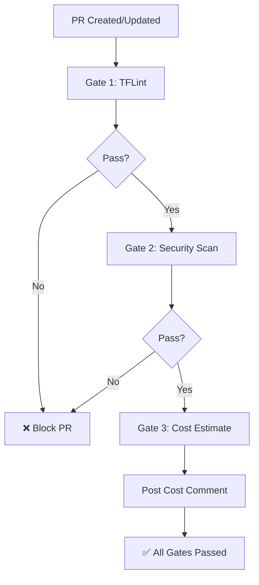

# Triple-Gated Terraform CI/CD Pipeline

This workflow acts as an **automated Senior DevOps Reviewer** for all Terraform infrastructure changes. It runs three critical validation gates before allowing infrastructure changes to be merged.

## Overview

The pipeline automatically runs on:

- Pull requests that modify `terraform/**` files
- Pushes to `main` branch affecting Terraform code

## The Three Gates

### 🔍 Gate 1: TFLint - Provider-Specific Validation

**Purpose:** Catch AWS provider-specific errors and enforce Terraform best practices.

**What it checks:**

- ✅ Terraform naming conventions
- ✅ Variable documentation
- ✅ Type safety for variables
- ✅ Unused declarations
- ✅ Deprecated syntax
- ✅ Required provider versions
- ✅ AWS-specific resource configurations

**Technology:** [TFLint](https://github.com/terraform-linters/tflint) with AWS ruleset

**Pass Criteria:** Zero errors found

---

### 🔒 Gate 2: Security Scanner - Infrastructure Security

**Purpose:** Identify security vulnerabilities before they reach production.

**What it checks:**

- ✅ No publicly accessible S3 buckets
- ✅ No overly permissive security groups
- ✅ Encryption enabled on sensitive resources
- ✅ Proper IAM role configurations
- ✅ Network security best practices
- ✅ Secrets management compliance

**Technology:** [Trivy](https://trivy.dev/) by Aqua Security

**Pass Criteria:** No MEDIUM or higher severity issues

**Additional Features:**

- Uploads findings to GitHub Security tab (SARIF format)
- Integrates with GitHub Code Scanning
- Actively maintained (replaces deprecated tfsec)

---

### 💰 Gate 3: Infracost - Cost Estimation

**Purpose:** Provide visibility into infrastructure costs before deployment.

**What it shows:**

- 💵 Monthly cost estimates for new/changed resources
- 📊 Cost breakdown by resource type
- 📈 Cost comparison (before vs. after changes)
- 💡 Cost optimization suggestions

**Technology:** [Infracost](https://www.infracost.io/)

**Output:** PR comment with detailed cost breakdown

**Fallback:** If Infracost API key is not configured, provides manual cost estimates:

- ECS Fargate: ~$35-40/month
- Application Load Balancer: ~$20-25/month
- NAT Gateways: ~$70/month
- Total: ~$130-145/month

---

## Setup Instructions

### Prerequisites

All tools run automatically in GitHub Actions. No local installation required.

### Enable Infracost (Optional but Recommended)

1. Sign up for free at [infracost.io](https://www.infracost.io/)
2. Get your API key
3. Add as GitHub secret:
   - Go to repository **Settings** → **Secrets and variables** → **Actions**
   - Click **New repository secret**
   - Name: `INFRACOST_API_KEY`
   - Value: Your Infracost API key
   - Click **Add secret**

Without the API key, Gate 3 will still pass but provide manual cost estimates.

---

## Workflow Behavior

### On Pull Request



### Required Status Checks

The workflow will **block merging** if:

- ❌ TFLint finds errors
- ❌ Trivy finds MEDIUM+ severity issues

The workflow will **warn** but allow merging if:

- ⚠️ Infracost API key is not configured (manual estimates provided)

---

## Example Output

### Gate 1: TFLint

```text
✅ TFLint validation passed - No provider-specific issues found
```

### Gate 2: Security Scan

```text
✅ No security issues found
- No public S3 buckets
- No overly permissive security groups
- Encryption enabled where required
```

### Gate 3: Cost Estimation

```text
💰 Monthly Cost Estimate: $135.42
┏━━━━━━━━━━━━━━━━━━━━━┳━━━━━━━━━━━━━┓
┃ Resource             ┃ Monthly Cost ┃
┡━━━━━━━━━━━━━━━━━━━━━╇━━━━━━━━━━━━━┩
│ aws_ecs_service      │ $36.50       │
│ aws_lb               │ $22.00       │
│ aws_nat_gateway (x2) │ $72.00       │
│ aws_route53_zone     │ $0.50        │
│ Data transfer        │ $4.42        │
└──────────────────────┴──────────────┘
```

---

## Customization

### Adjust TFLint Rules

Edit the inline `.tflint.hcl` configuration in the workflow file:

```hcl
rule "terraform_naming_convention" {
  enabled = true
  # Add custom naming patterns
}
```

### Adjust Security Severity

Modify the `severity` parameter in the Trivy step:

```yaml
severity: 'HIGH,CRITICAL'  # Change from MEDIUM,HIGH,CRITICAL
```

### Customize Cost Thresholds

Add cost threshold checks in the Infracost step:

```yaml
- name: Check cost threshold
  run: |
    COST=$(jq '.totalMonthlyCost' infracost.json)
    if (( $(echo "$COST > 200" | bc -l) )); then
      echo "Cost exceeds threshold!"
      exit 1
    fi
```

---

## Troubleshooting

### TFLint Errors

**Problem:** "Plugin initialization failed"
**Solution:** Clear the TFLint cache by re-running the workflow

**Problem:** "AWS ruleset not found"  
**Solution:** Verify internet connectivity; TFLint downloads plugins automatically

### Trivy Warnings

**Problem:** "False positive security warnings"  
**Solution:** Add exceptions in a `.trivyignore` file in the repository root:

```text
# Justified reason for ignoring this check
AVD-AWS-0086
```

Or use inline exceptions in Terraform code (tfsec-style comments still work):

```hcl
#tfsec:ignore:aws-s3-enable-versioning
resource "aws_s3_bucket" "example" {
  # Justified reason for ignoring
}
```

### Infracost Issues

**Problem:** "No cost estimate available"
**Solution:**

1. Verify INFRACOST_API_KEY is set correctly
2. Check that Terraform plan succeeded
3. Review Infracost service status

---

## Integration with Branch Protection

Recommended branch protection rules for `main`:

1. Go to **Settings** → **Branches** → **Branch protection rules**
2. Add rule for `main`
3. Enable:
   - ✅ Require status checks to pass before merging
   - ✅ Require branches to be up to date before merging
4. Select required status checks:
   - `Gate 1 - TFLint`
   - `Gate 2 - Security Scan (Trivy)`
   - `Validation Summary`

---

## Benefits

### For Developers

- 🚀 Fast feedback on infrastructure changes
- 📚 Learn Terraform best practices automatically
- 🔒 Catch security issues before code review

### For DevOps Teams

- 🎯 Consistent infrastructure quality
- 💰 Cost visibility and control
- 🛡️ Security compliance automation
- ⏱️ Reduced manual review time

### For the Organization

- 💵 Prevent unexpected cloud costs
- 🔐 Maintain security posture
- 📊 Infrastructure change audit trail
- ⚡ Faster deployment cycles

---

## Resources

- [TFLint Documentation](https://github.com/terraform-linters/tflint)
- [Trivy Documentation](https://trivy.dev/)
- [Infracost Documentation](https://www.infracost.io/docs/)
- [Terraform Best Practices](https://www.terraform-best-practices.com/)

---

## Contributing

To improve this pipeline:

1. Test changes in a separate branch
2. Verify all three gates still function
3. Update this documentation
4. Submit PR with validation results
